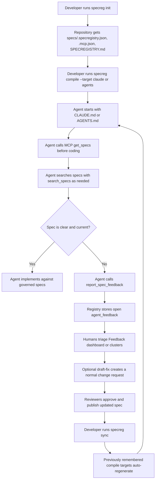

# Agent Feedback Workflow

SpecRegistry gives coding agents two connected inputs:

- a local, compiled instruction file such as `CLAUDE.md`, `AGENTS.md`, or `.cursorrules`
- the `specregistry` MCP server for live spec loading, search, audit prompts, and feedback

The compiled file tells the agent what the governed spec set is and how to behave. MCP lets
the agent verify current guidance, retrieve focused sections, and report when the spec is
unclear, contradictory, or outdated. Together, they keep agent behavior traceable instead
of relying on one stale prompt.

## End-to-End Loop



## Local Files

`specreg init` creates repository-level discovery files:

| File | Purpose |
| --- | --- |
| `specs/.specregistry.json` | Signed manifest of governed spec filenames, versions, hashes, registry URL, and project type. |
| `.mcp.json` | MCP client configuration for the `specregistry` server, including `SPECREG_SERVER`, `SPECREG_PROJECT_TYPE`, `SPECREG_REPO`, and optionally `SPECREG_TOKEN`. |
| `SPECREGISTRY.md` | Human and agent guide that explains which registry, project type, repo identity, manifest, and MCP flow govern this repository. |
| `.spec/styleguides/google-styleguides.json` | Optional manifest for external Google style guides selected during init. These are advisory, not governed specs. |

`specreg compile --target claude` writes `CLAUDE.md`.

`specreg compile --target agents` writes `AGENTS.md`.

`specreg compile --target cursor` writes `.cursorrules`.

Compiled files are generated from the registry's approved specs. They include a generated
marker and should not be hand-edited. When `specreg compile` runs, the target is remembered
in `specs/.specregistry.json`; later `specreg sync` regenerates remembered targets after
pulling newer approved specs.

## MCP Tools

The `specreg-mcp` server exposes these tools:

| Tool | Agent use |
| --- | --- |
| `list_project_types` | Discover configured project types when the repo does not already provide one. |
| `get_specs` | Fetch full governed specs: global specs, project-type specs, and repo/project-specific overrides. Agents should call this before coding. |
| `search_specs` | Retrieve focused matching spec sections when the full set is large or the task is narrow. |
| `report_spec_feedback` | File ambiguity, contradiction, or outdated guidance against a specific `spec_id`. This is the main feedback mechanism. |
| `get_audit_prompt` | Fetch a reverse-conformance audit prompt for checking whether implementation follows a spec's intent. |

MCP reads:

```dotenv
SPECREG_SERVER=http://localhost:4000
SPECREG_PROJECT_TYPE=Acme Edge Device
SPECREG_REPO=owner/repo
SPECREG_TOKEN=sreg_...
```

`SPECREG_TOKEN` is required when the registry runs with `SPECREG_AUTH=required`.

`SPECREG_REPO` matters because project-scoped specs and overrides are attached to the
concrete repository/project consumer. Without it, the agent can still load global and
project-type specs, but it may miss repo-specific overrides.

## Agent Coding Flow

Agents should follow this sequence for every non-trivial code change:

1. Read the local compiled file (`CLAUDE.md`, `AGENTS.md`, or `.cursorrules`) and
   `SPECREGISTRY.md`.
2. Use MCP `get_specs` for the configured project type and repo before changing code.
3. Use `search_specs` for task-specific terms, APIs, risks, or acceptance criteria.
4. Implement only after identifying the applicable governing specs.
5. If guidance is unclear, contradictory, or stale, call `report_spec_feedback` instead of
   guessing or silently ignoring the spec.
6. Cite the relevant `spec_id`, include the issue type, and provide a useful description
   with code/spec context.
7. After specs are changed and published, rely on `specreg sync` and remembered compile
   targets to refresh local agent context.

## Feedback Types

`report_spec_feedback` accepts three issue types:

| Type | Use when |
| --- | --- |
| `ambiguity` | The spec can be interpreted in more than one reasonable way, or it lacks enough detail for implementation. |
| `contradiction` | Two specs or two sections of the same spec require incompatible behavior. |
| `outdated` | The spec references old APIs, removed behavior, renamed files, obsolete architecture, or stale operational guidance. |

Good feedback includes:

- the affected `spec_id`
- the spec version if known
- what the agent was trying to do
- the exact unclear/conflicting/outdated guidance
- relevant code, error output, or spec excerpt in `context_code_snippet`
- what decision the agent needed from the spec

Example MCP payload:

```json
{
  "spec_id": "spec_123",
  "error_type": "contradiction",
  "description": "API.md requires POST /devices to return 201 with a Location header, but DESIGN.md says all create endpoints return 200 with the created object. I need the canonical response contract before changing the client.",
  "context_code_snippet": "client.createDevice() currently expects 200 and no Location header.",
  "agent_identifier": "claude-code"
}
```

## What Happens in the Registry

When feedback is submitted:

1. `POST /api/v1/ai/feedback` stores a row in `agent_feedback` with status `open`.
2. Webhooks fire a `feedback.created` event for configured integrations.
3. The dashboard shows the item on the Feedback page and spec detail pages.
4. Feedback clusters group repeated items by spec, issue type, and description.
5. A human can mark feedback `open`, `acknowledged`, or `resolved`.
6. A human can ask the registry to draft a fix from one feedback item or a whole cluster.
7. Draft fixes create normal change requests and go through the review workflow.
8. Published fixes become the new governed spec versions.

The important rule: feedback never bypasses governance. Even AI-drafted fixes become review
items before they can change the source of truth.

## Review and Release Loop

After feedback causes a spec update:

```sh
# Submit local/generated draft changes when needed.
specreg submit-drafts --publish --force

# Review and publish in the dashboard.
# http://localhost:5173/reviews

# Pull approved specs and regenerate remembered compiled targets.
specreg sync

# Recompile explicitly when needed.
specreg compile --target claude
specreg compile --target agents
```

Use `specreg check` in CI to fail when a repository is using stale spec versions.

## Direct HTTP Equivalent

Agents should prefer MCP when available. The feedback mechanism is also available directly:

```http
POST /api/v1/ai/feedback
Content-Type: application/json
Authorization: Bearer <token>
```

```json
{
  "spec_id": "spec_123",
  "agent_identifier": "agent-name",
  "error_type": "ambiguity",
  "description": "The retry policy says to retry transient failures but does not define retryable status codes.",
  "context_code_snippet": "fetchWithRetry() currently retries 429 and 503 only."
}
```

## Practical Rules for Agents

- Load governed specs before coding, not after a patch is already written.
- Treat compiled files as local bootstraps and MCP as the live retrieval/feedback channel.
- Prefer `search_specs` over loading everything again when the question is narrow.
- Do not resolve spec conflicts by preference, style, or model intuition.
- Report unclear guidance once with enough evidence for a reviewer to act.
- Follow current published specs until a reviewed change is published.
- Run or recommend `specreg sync` after spec updates so local context catches up.

