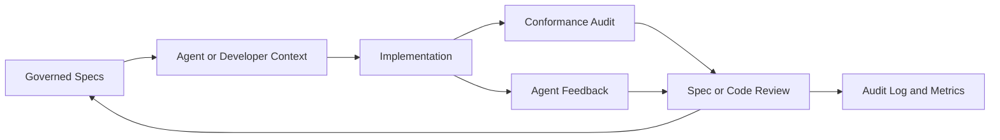

# Spec Driven Development and Tokenomics

SpecRegistry exists to make Spec Driven Development (SDD) observable, enforceable, and economically sane for both humans and AI agents.

The central claim of SDD is simple: implementation work should be governed by explicit, versioned specifications rather than by tribal memory, hidden reviewer preference, or whatever context an agent happened to receive. In an AI-assisted organization, this becomes more important because agents are highly sensitive to context quality. If the governing context is stale, contradictory, too large, too vague, or missing intent, the agent may still produce plausible work while drifting away from what the organization actually wanted.

SpecRegistry is therefore not only a document store. It is an SDD control plane.

It answers:

- Which specs governed this work?
- Were the specs current?
- Did the agent or developer read them?
- Did the implementation violate them?
- Did the specs conflict with each other?
- Did the implementation follow the letter of a spec while missing the intended outcome?
- Which specs earn their token cost, and which specs add noise?
- Where are agents repeatedly confused?
- Which review, approval, and publication events changed the governing rules?

## Operating Model

SDD has four durable objects:

- **Specs**: versioned Markdown requirements, guidance, contracts, standards, and process rules.
- **Implementations**: code, configuration, infrastructure, documentation, tests, or generated artifacts created under spec governance.
- **Evidence**: manifests, audit findings, feedback, search events, drift checks, review approvals, efficacy runs, and audit log entries.
- **Decisions**: reviewed spec changes, rejected changes, beta promotions, policy changes, and human triage outcomes.

The system is healthy when these objects form a traceable loop:

The loop is broken when work happens without a manifest, agents use ungoverned context, feedback is ignored, spec changes bypass review, or metrics cannot explain why a spec was useful.

## Strict SDD Process

Every governed repository should follow this workflow.

1. **Initialize**
   For a new project, run interactive `specreg init` and complete the structured project
   walkthrough. It captures intended technology and operating constraints, attaches the repo
   to an existing or newly-created project type, pulls approved baseline specs, and submits a
   project-scoped `PROJECT_PROFILE.md` draft for review. For an established/premade baseline
   or non-interactive automation, use `specreg init --type <name>`.
   Initialization writes `specs/.specregistry.json`, MCP configuration, and agent discovery
   guidance. Questionnaire answers are not governed until the project profile is reviewed and published.
   Select the smallest useful set of governed agent skills during initialization. Safe built-in
   procedures are selected by default and installed under `.spec/skills/`. Restricted skills
   require deliberate selection. Skills structure agent behavior but never override host approval,
   least-privilege requirements, or published specs.
   For auth-required registries, pass `--token <token>` or set `SPECREG_TOKEN`; `specreg init` carries that token into the generated MCP configuration.
   Init also scans the repository and offers a suggested multi-select of Google style
   guides from `https://google.github.io/styleguide/`, including `/docguide` for
   documentation work. These guides are converted to Markdown under `.spec/styleguides/`
   as advisory external context, while the registry manifest remains the governed source
   of truth. See `README-GOOGLE-STYLEGUIDES.md` for the catalog, selection rules, and
   conflict semantics.

2. **Load Agent Context**
   Agents should use the SpecRegistry MCP server and call `get_specs` before code changes. In a concrete repository, configure `SPECREG_REPO` so the agent receives the repo's project-scoped specs in addition to global and project-type specs. If an agent cannot use MCP, provide the generated `CLAUDE.md`, `AGENTS.md`, `.cursorrules`, or the full agent pack from `GET /api/v1/specs/:type/agent-pack`.
   In server or Docker deployments, configure `SPECREG_PUBLIC_URL` so generated MCP config points to the reachable registry URL rather than the container's local bind address.
   If `SPECREG_AUTH=required`, MCP clients must set `SPECREG_TOKEN` so `get_specs`, `search_specs`, and `report_spec_feedback` can authenticate.

3. **Check Drift**
   CI should run `specreg check`. Drift is a governance failure, not a style nit. The implementation may be correct against an old spec and wrong against the current one.
   The bundled GitHub Action can run this check in pull requests and post a durable PR comment
   with the exact drift output. When a repository is not yet reporting manifests, admins can
   paste its `.specregistry.json` into the Reports page to diagnose local vs registry versions.

4. **Implement**
   Work proceeds against the active spec set. When specs are unclear, agents should call `report_spec_feedback` rather than guess.
   Search and agent-spec responses include section anchors/permalinks so feedback and audit findings can cite the exact governing section.
   For larger spec packs, agents should prefer hybrid search so exact FTS5 matches and
   section-level semantic matches are both considered under the task's context budget.

5. **Audit**
   Use reverse conformance audit (`specreg audit` or `POST /api/v1/ai/audit`) to check whether the implementation follows the governed specs.
   Server-side LLM features should use the configured provider for the deployment: Anthropic, OpenAI, Gemini, an OpenAI-compatible gateway, or a local/network model endpoint.

6. **Review Evidence**
   Reviewers should inspect diffs, lint, compatibility, contradiction reports, approval policy, recorded approvers, feedback clusters, audit findings, and audit log entries.
   The review SLA summary highlights pending changes that are approaching or past the configured age thresholds.
   Publish previews should also be treated as blast-radius evidence: affected manifest
   consumers, repo subscriptions, dependent specs, open feedback, recent usage, and the
   calculated impact level indicate how carefully a change should be reviewed.
   For downstream work, reviewers should use the generated migration checklist and
   PR summary/changelog so subscribed repositories receive actionable verification steps,
   not just updated Markdown.

7. **Improve Specs**
   If implementation problems arise from unclear or conflicting specs, update specs through the review workflow. Do not patch around bad guidance silently.

## Tokenomics

Tokenomics is the discipline of treating agent context as a scarce, measurable budget.

In SDD, every spec competes for attention. A spec can be correct and still harmful if it consumes tokens without changing outcomes. A spec can be short and still expensive if it causes ambiguity, repeated feedback, or implementation churn.

SpecRegistry should help answer:

- How often is this spec loaded by agents?
- How often does search retrieve this spec?
- How often does this spec generate feedback?
- Does this spec improve agent output in efficacy tests?
- Does this spec conflict with other specs?
- Is this spec stale but frequently used?
- Is this spec long relative to the value it provides?
- Does this spec cause agents to produce technically compliant but unwanted work?

## Token ROI

A useful spec earns its tokens when it changes behavior in the desired direction.

High-ROI specs tend to be:

- Specific enough to constrain implementation.
- Short enough to be read with other relevant context.
- Structured into searchable sections.
- Explicit about non-goals and intent.
- Linked to examples, contracts, or tests.
- Measurably useful in efficacy runs.

Low-ROI specs tend to be:

- Repetitive with global standards.
- Vague or aspirational.
- Too broad to guide local decisions.
- Full of stale implementation details.
- Contradictory with another spec.
- Often retrieved but rarely cited or followed.
- Frequently associated with ambiguity feedback.

## Token Budget Classes

Specs should be written with a budget class in mind.

| Class | Purpose | Token Behavior |
| --- | --- | --- |
| Global invariant | Security, compliance, universal engineering rules | Always loaded; must be compact and stable |
| Project contract | API, data model, protocol, architecture boundaries | Loaded for the project type; detailed enough to prevent drift |
| Workflow rule | Git, review, observability, ticket process | Loaded for agent/developer process; should be checklist-oriented |
| Reference detail | Large schemas, maps, generated contracts | Search-first; avoid always-loading unless essential |
| Temporary migration | Time-bound transition guidance | Must include expiration or review date |

The registry should prefer always-loading invariants only when the cost is justified. Large reference material should be searchable and section-addressable rather than blindly injected into every prompt.

## Observability Model

Deep SDD observability requires more than page views.

SpecRegistry should observe at least these signals:

- **Distribution**: downloads, agent reads, compiled context generation, agent pack downloads.
- **Currency**: drift checks, stale specs, local manifest versions.
- **Usefulness**: search hits, efficacy scores, feedback frequency.
- **Correctness**: audit findings, lint failures, compatibility warnings.
- **Governance**: review approvals, rejections, publish events, beta promotions, policy changes.
- **Identity**: actor, role, source, API key usage, LDAP role mapping.
- **Friction**: repeated ambiguity clusters, draft-fix usage, unresolved feedback age.

The goal is not surveillance. The goal is explainability: when SDD fails, the organization should know whether the failure came from code, context, stale distribution, conflicting guidance, missing intent, or insufficient review.

## Failure Modes

### 1. Spec Drift

The implementation follows a previous version, but the registry has moved on.

Evidence:

- `specreg check` reports outdated or missing specs.
- Manifest versions do not match the latest approved versions.
- Audit findings cite requirements added after the local copy.

Response:

- Sync specs.
- Re-run tests/audit.
- Treat major drift as a review-blocking condition.

### 2. Spec Conflict

Two or more specs require incompatible behavior.

Examples:

- Global security requires TLS-only transport, while a project API spec permits plaintext management traffic.
- Documentation standards require one naming convention, while project structure requires another.
- Observability standards require trace IDs everywhere, while an embedded protocol forbids additional payload bytes.

Evidence:

- Agent feedback of type `contradiction`.
- Repeated feedback clusters across multiple agents.
- Audit findings that cite different specs for opposing recommendations.
- Review compatibility reports showing removed or renamed sections that affect dependent specs.

Response:

- Do not choose silently.
- File feedback against the conflicting specs.
- Resolve with a reviewed spec change.
- Prefer explicit override language when project-specific constraints intentionally narrow global guidance.

### 3. Spec Followed, Intent Missed

This is one of the most important SDD failure modes.

The implementation satisfies the literal spec, but the result is not what the organization intended.

Examples:

- A spec says “log all security-relevant decisions,” so the implementation logs them, but the logs are unstructured and unusable for incident response.
- A spec says “commands must be idempotent,” so retries do not corrupt state, but the API still returns ambiguous status codes that make clients unsafe.
- A spec says “provide tests for new behavior,” so tests are added, but they verify mocks instead of user-visible behavior.
- A spec says “use the approved design pattern,” so the code uses the right pattern vocabulary, but the operational failure mode remains unhandled.

Evidence:

- Reverse audit reports no violations, yet reviewers reject the implementation.
- Efficacy tests show little difference between with-spec and without-spec outputs.
- Feedback descriptions mention “technically compliant but not useful.”
- Users or reviewers repeatedly ask for implicit outcomes that are not encoded in the spec.

Response:

- Update the spec to encode intent, non-goals, and acceptance criteria.
- Add examples of good and bad implementations.
- Add outcome-oriented lint or audit prompts.
- Add efficacy test prompts that capture the missed intent.

### 4. Over-Specification

The spec constrains details that should be implementation choices.

Evidence:

- Frequent patch churn.
- Many local exceptions.
- Agents report outdated guidance.
- Implementations become worse because they preserve obsolete details.

Response:

- Move volatile details to examples or reference sections.
- Replace rigid implementation requirements with outcome requirements.
- Add explicit extension points.

### 5. Under-Specification

The spec says what to build but not what “good” means.

Evidence:

- Ambiguity feedback.
- Divergent implementations across repos.
- Reviewers rely on unwritten expectations.
- Efficacy tests show weak or inconsistent lift.

Response:

- Add acceptance criteria.
- Add examples.
- Add “must not” constraints.
- Add operational requirements such as observability, failure modes, and migration behavior.

### 6. Token Saturation

The agent receives too much context and fails to prioritize the governing requirements.

Evidence:

- Long specs are loaded but not reflected in output.
- Search results outperform full-context loads.
- Efficacy scores improve after shortening or restructuring.
- Agents comply with nearby text but miss higher-priority global rules.

Response:

- Split specs by concern.
- Make summaries authoritative.
- Move large references behind search.
- Use agent packs and compiled files selectively.

## Conflict Detection Strategy

Spec conflict detection should combine deterministic and model-assisted checks.

Deterministic checks:

- Same heading removed or renamed across related specs.
- Same keyword with opposing modal verbs, such as `must` vs `must not`.
- Global/project override without explicit override language.
- Template lint failures.
- Semver delta too small for section removal.

Model-assisted checks:

- Compare global plus project specs and ask for incompatible requirements.
- Ask whether project-specific guidance narrows or contradicts global guidance.
- Ask whether examples violate stated requirements.
- Ask whether a spec’s acceptance criteria actually test its stated intent.

Human review remains the safety gate. Automated conflict detection should produce evidence, not auto-publish changes.

## Observing Intent Alignment

A spec can only govern intent if intent is written down.

Intent-bearing sections should answer:

- What user or operational outcome is this spec protecting?
- What failure modes is this spec trying to prevent?
- What tradeoffs are acceptable?
- What tradeoffs are forbidden?
- What are examples of compliant but unacceptable implementations?
- What should an agent do when the spec conflicts with local code?

SpecRegistry should treat missing intent as an observability gap. If reviewers repeatedly reject spec-compliant implementations, the spec should be changed, not merely the implementation.

## Metrics

Useful SDD metrics include:

| Metric | Meaning |
| --- | --- |
| Agent read count | How often agents load governed specs |
| Search count | Which specs are retrieved by need |
| Drift count | How often repos are behind approved specs |
| Feedback count | Where agents experience ambiguity, contradiction, or staleness |
| Feedback cluster size | Whether confusion is isolated or systemic |
| Audit finding count | Whether implementations violate specs |
| Efficacy lift | Whether specs improve agent output |
| Token load | Approximate prompt cost of always-loaded specs |
| Review latency | How long spec changes wait for approval |
| Approval policy misses | Reviews blocked by missing required approvers |
| Stale load-bearing specs | Old specs still frequently read or searched |
| Contradiction findings | Proposed guidance that appears to reverse existing specs |
| Section citation coverage | Whether feedback and audits point to exact spec sections |

SpecRegistry exposes operational Prometheus metrics at `GET /metrics`. These include
registry counts such as `specregistry_specs_total`, `specregistry_reviews_total`,
`specregistry_feedback_total`, `specregistry_usage_events_total`,
`specregistry_audit_events_total`, and `specregistry_oldest_pending_review_age_seconds`.
In Docker deployments, the optional Grafana Alloy profile can scrape these metrics and
remote-write them to a Grafana Cloud or Prometheus-compatible endpoint.

LLM provider settings are part of tokenomics. Local or network OpenAI-compatible endpoints
can reduce spend and keep prompts inside an internal network; hosted providers may provide
stronger reasoning for high-value audits and efficacy checks. The Settings page exposes
configurable cheap, standard, and frontier tiers, each with provider, model, base URL, token
budget, model discovery, saved-key status, and connectivity tests. Feature routing maps
classification, summarization, planning, tickets, maintenance, generation, audits, draft
fixes, efficacy, and tests to the appropriate tier so prompt budget is spent in proportion
to governance risk.

## Review Guidance

Spec reviewers should ask:

- Does this spec encode intent, not only mechanics?
- Does it conflict with global guidance?
- Does it duplicate another spec?
- Is the semver bump appropriate?
- Are required sections present?
- Is this short enough to earn its default loading cost?
- Should this be always-loaded, searchable reference, or temporary migration guidance?
- How would an agent know when to report feedback instead of guessing?

Implementation reviewers should ask:

- Which spec versions governed this work?
- Did CI confirm no drift?
- Did the agent use MCP or a compiled context file?
- Are audit findings resolved or intentionally waived?
- Is the implementation compliant in letter but wrong in intent?
- Does the implementation reveal a missing spec requirement?

## Agent Instructions

Agents operating under SDD should follow these rules:

1. Load governed specs before implementation.
2. Search specs when local context is insufficient.
3. Cite relevant specs in summaries and PR descriptions when possible.
4. Report spec ambiguity instead of guessing.
5. Treat drift as a blocker unless explicitly instructed otherwise.
6. Prefer intent-preserving implementations over literal loopholes.
7. If the spec appears wrong, propose a spec feedback item or change request rather than silently ignoring it.

## Roadmap Implications

The project should continue evolving toward:

- Section-level citations and permalinks.
- Automated conflict detection.
- Outcome-oriented audit prompts.
- Feedback cluster actions.
- Token ROI dashboards.
- Semantic search for large reference specs.
- Scheduled efficacy tests.
- Review SLA and stale-spec dashboards.
- Encrypted secrets and enterprise audit controls.

The north star is not “more specs.” The north star is **observable alignment**: every important implementation decision should be traceable to current, coherent, valuable specifications, and every repeated failure should teach the registry how to improve those specifications.
